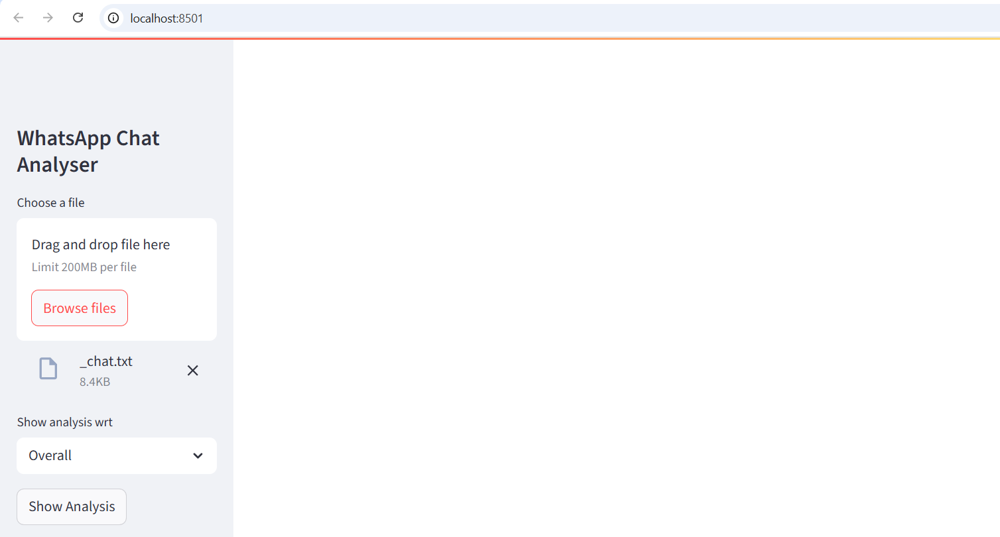

# WhatsApp Chat Analyzer

Analyze your WhatsApp conversations with data-driven insights, statistics, and visualizations using Streamlit.

## 📊 Features

- **Message Frequency Analysis**: Visualize message counts over time.
- **User Activity**: Identify the most active participants.
- **Word Cloud**: Display frequently used words.
- **Media Sharing Stats**: Analyze media sharing patterns.
- **Busiest Times**: Determine peak chat hours and days.

## 🚀 Getting Started

Follow these steps to set up and run the WhatsApp Chat Analyzer locally.

#1️⃣ Clone the Repository
```bash
git clone https://github.com/kirti111agarwal/whatsapp-chat-analyzer.git
```

#2️⃣ Install Dependencies
```bash
pip install -r requirements.txt
```

#3️⃣ Run the App
```bash
streamlit run app.py
```
## ⬆️ Upload Your WhatsApp Chat

1. **Export your chat from WhatsApp:**
   - Open the chat you want to analyze (either a **group chat** or a **one-on-one conversation**).  
   - Tap the **three dots (⋮) → More → Export Chat**.  
   - Choose **Without Media** to get a `.txt` file.  
   - Save the exported file to your device.
   - 

2. Open the app in your browser (Streamlit will provide the local URL).  
3. Upload your `.txt` chat file through the app interface.  

Now you can explore your WhatsApp chat data with interactive visualizations and insights! 🎉


## 📁 Project Structure

app.py: Main Streamlit application.

preprocessor.py: Functions for data preprocessing.

helper.py: Utility functions for analysis.

requirements.txt: Project dependencies.

whatsapp_chat_example.txt: Sample chat file for testing. (my personal whatsapp chat group)

## 😄 Running App Screenshots 




## 📌 Notes
Ensure your chat file is in .txt format.

The app processes the chat data to provide various insights and visualizations.

Happy analyzing! 🎉
